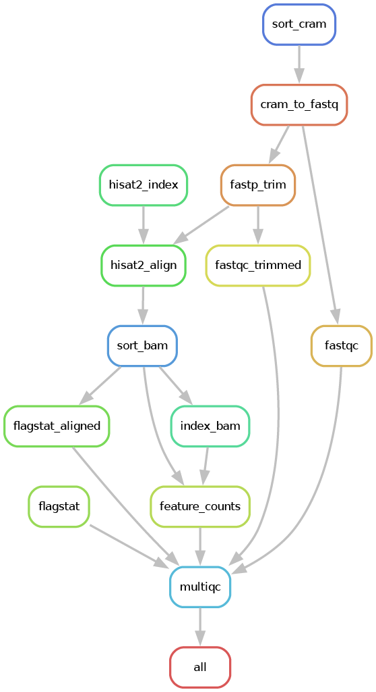

# canine-seq

canine-seq is a snakemake workflow for processing bulk paired-end RNA-seq data stored in unaligned CRAM format. The workflow performs quality control, adapter trimming, alignment, gene-level quantification and generation of multiQC reports. Reads that fail to align to the host genome are extracted and re-aligned against a viral genome for detection of viral transcripts. 

## Features

- `samtools`: FASTQ extraction from CRAM files
- `fastqc`: quality control metrics
- `fastp`: Adapter and quality trimming
- `HISAT2`: Genome alignment
- `featureCounts`: Gene-level quantification
- `MultiQC`: Aggregated quality control reports



---

## Installation
Clone the repository:

```bash
git clone https://github.com/elisefeld/canine-seq.git
cd canine-seq
```

Detailed installation instructions are available in [install.md](docs/INSTALL.md).

### Dependencies
- Snakemake
- Python ≥ 3.14
- pandas
- samtools
- FastQC
- fastp
- HISAT2
- featureCounts (Subread)
- MultiQC

It is recommended to run this program inside a conda environment using a conda package manager and `config/env.yaml`.

---

## Usage

### Input

The raw data in CRAM format and the corresponding sample sheet must be stored in a subdirectory under `data/` The name of this folder must be specified using `project.name` in `config.yaml` 

The sample sheet file name is specified by `run.sample_sheet` in `config.yaml`. It must contain a column named `sample_id` containing sample names that exactly match the CRAM filenames (excluding extensions). An example sample sheet is provided [here](config/example_sheet.csv).

Host and viral reference files must be stored in subdirectories under `data/reference/`. The subdirectory names must match the values specified in `ref.main.name` and `ref.virus.name` within `config.yaml`. These subdirectories must each contain a genome fasta file and annotation gtf file corresponding to the correct organism. 


```text
canine_seq/
├── config/
│   ├── env.yaml
│   └── config.yaml
├── data/
│   ├── <PROJECT.NAME>/
│   │   ├── sample.cram
│   │   ├── sample.cram.crai
│   │   └── <RUN.SAMPLE_SHEET>
│   └── reference/
│       └── <REF.MAIN.NAME>/
│           ├── <REF.MAIN.FASTA>
│           └── <REF.MAIN.GTF>
|        └── <REF.VIRUS.NAME>/
│           ├── <REF.VIRUS.FASTA>
│           └── <REF.VIRUS.GTF>
└── runs/
    └── <RUN.RUN_NAME>/
        ├── logs/
        │   ├── main/
        │   └── virus/
        ├── report/
        │   ├── main/
        │   └── virus/
        ├── igv/
        │   ├── main/
        │   └── virus/
        └── results/
            ├── main/
            └── virus/
```

### Example Configuration

**config.yaml**

```yaml
project:
  name: my_project

run:
  run_name: test_run
  sample_sheet: sample_sheet.csv

ref:
  main:
    name: host_reference
    fasta: genome.fa
    gtf: genes.gtf
  virus:
    name: virus_reference
    fasta: virus.fa
    gtf: virus.gtf

threads:
  samtools: 8
  fastqc: 2
  fastp: 8
  hisat2: 16
  featurecounts: 4
```

**sample_sheet.csv**

```csv
sample_id
SAMPLE001
```

**Example Directory Layout**

```text
canine_seq/
├── config/
|   ├── env.yaml
│   └── config.yaml
├── data/
│   ├── my_project/
│   │   ├── SAMPLE001.cram
│   │   ├── SAMPLE001.cram.crai
│   │   └── sample_sheet.csv
│   │
│   └── reference/
│       └── host_reference/
│           ├── genome.fa
│           └── genes.gtf
|        └── virus_reference/
|           ├── virus.fa
│           └── virus.gtf
└── runs/
    └── test_run/
        ├── logs/
        │   ├── main/
        │   └── virus/
        ├── report/
        │   ├── main/
        │   └── virus/
        ├── igv/
        │   ├── main/
        │   └── virus/
        └── results/
            ├── main/
            └── virus/
```

### Threads
The number of threads can be specified for each tool using `config.yaml`.
```yaml
threads:
  samtools: 6
  fastqc: 1
  fastp: 4
  hisat2: 8
  featurecounts: 2
```
---

## Running the Workflow

Perform a dry run:

```bash
snakemake -n -p
```

Generate a workflow DAG:

```bash
snakemake --dag | dot -Tpdf > dag.pdf
```

Generate a workflow rulegraph:

```bash
snakemake --rulegraph | dot -Tpdf > rulegraph.pdf
```

Run the pipeline:

```bash
snakemake --cores 8
```


## Output

Upon completion, the workflow will generate:

```text
runs/
└── <RUN_NAME>/
    ├── logs/
    │   ├── main/
    │   └── virus/
    │
    ├── report/
    │   ├── main/
    │   │   └── multiqc_report.html
    │   │
    │   └── virus/
    │       └── multiqc_virus_report.html
    │
    ├── results/
    │   ├── main/
    │   │   ├── fastp/
    │   │   ├── fastqc/
    │   │   ├── featurecounts/
    │   │   ├── flagstat/
    │   │   ├── hisat2/
    │   │   └── sort/
    │   │
    │   └── virus/
    │       ├── fastqc/
    │       ├── featurecounts/
    │       ├── fastq/
    │       ├── hisat2/
    │       ├── sort/
    │       └── unmapped/
    │
    └── igv/
        └── main/
            ├── *.bam
            └── *.bam.bai
```

#### Key Outputs

| Output | Location | Description |
|----------|----------|-------------|
| MultiQC Reports | `runs/<RUN_NAME>/report/main/multiqc_report.html`, `runs/<RUN_NAME>/report/virus/multiqc_virus_report.html` | Interactive summary of quality control metrics, alignment statistics, and gene quantification results for the host or virus detection workflows. |
| Gene Counts | `runs/<RUN_NAME>/results/main/featurecounts/counts.txt`, `runs/<RUN_NAME>/results/virus/featurecounts/counts_viral.txt` | Gene-by-sample count matrix generated from host or virus genome alignments using featureCounts. |Quality control reports generated after adapter and quality trimming. |
| Aligned BAM Files | `runs/<RUN_NAME>/results/main/sort/`, `runs/<RUN_NAME>/results/virus/sort/` | Name-sorted BAM files generated following alignment to the host or viral genome. |
| IGV-ready BAM and BAM index Files | `runs/<RUN_NAME>/igv/main/*.bam`, `runs/<RUN_NAME>/igv/main/*.bam.bai` | Coordinate-sorted BAM and BAM index files suitable for visualization in IGV. |
| Workflow Logs | `runs/<RUN_NAME>/logs/` | Log files generated for each workflow step, useful for troubleshooting. |

---
## License

This project is distributed under the MIT license. See the [license](LICENSE) for more details. 

## Citations

If you use this workflow in a publication, please cite the following tools:

- Snakemake
- samtools
- FastQC
- fastp
- HISAT2
- featureCounts (Subread)
- MultiQC

Please also cite the reference genome and gene annotation resources used in your analysis.